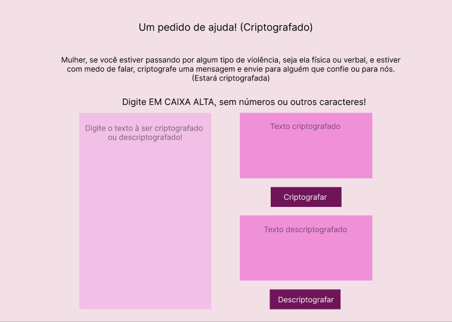

# Cifra de César 🕵️‍♂️

## Sobre o projeto 📰

A [cifra de César](https://pt.wikipedia.org/wiki/Cifra_de_C%C3%A9sar) é um dos primeiros tipos de criptografias conhecidas na história. A cifra  de César é uma das técnicas mais simples de cifrar uma mensagem. É um tipo de cifra por substituição, em que cada letra do texto original é substituida por outra que se encontra há um número fixo de posições (deslocamento) mais a frente do mesmo alfabeto.

## Minha ideia 💡

Pensei em criar uma aplicação web que cifre e decifre mensagens de mulheres em situação de vulnerabilidade e maus tratos, que tenham medo de falar o que acontece em suas casas ou ambientes de trabalho, mas que tenham medo, e além dessas mulheres, organizações que possam ajudar essas mulheres também terão acesso à plataforma, assim, se materá uma comunicação segura entre ambas.

## Como ele funciona ⚙️

A ideia foi deixá-lo o mais simples e intuitivo possível, o usuário digita a mensagem à ser cifrada ou decifrada, escolhe o deslocamento e possui dois botões, um para cifrar e outro para decifrar. Ele ainda n

## Tecnologias usadas 🛠 

- HTML5
- CSS3
- JavaScript(Vanilla)
- Node.js
- Jest

## Objetivos de aprendizagem 📌

### HTML

- [x] **Uso de HTML semântico**

### CSS

- [x] **Uso de seletores de CSS**

- [x] **Empregar o modelo de caixa (box model): borda, margem, preenchimento**

### Web APIs

- [x] **Uso de seletores de DOM**

- [x] **Manipulação de eventos de DOM**

- [x] **Manipulação dinâmica de DOM**

### JavaScript

- [x] **Tipos de dados primitivos**

- [x] **Strings (cadeias de caracteres)**

- [x] **Variáveis (declaração, atribuição, escopo)**

- [x] **Uso de condicionais (if-else, switch, operador ternário)**

- [x] **Uso de laços (for, for..of, while)**

- [x] **Uso de funções (parâmetros, argumentos, valor de retorno)**

- [x] **Testes unitários**

- [x] **Módulos de ECMAScript (ES modules)**

- [x] **Uso de linter (ESLINT)**

- [x] **Uso de identificadores descritivos (Nomenclatura | Semântica)**

### Controle de Versões (Git e GitHub)

- [x] **Git: Instalação e configuração**

- [x] **Git: Controle de versão com git (init, clone, add, commit, status, push, pull, remote)**

- [x] **GitHub: Criação de contas e repositórios, configuração de chave SSH**

- [x] **GitHub: Implantação com GitHub Pages**

### user-centricity

- [x] **Desenhar a aplicação pensando e entendendo a usuária**

### product-design

- [x] **Criar protótipos para obter feedback e iterar**

- [x] **Aplicar os princípios de desenho visual (contraste, alinhamento, hierarquia)**

## Protótipo inicial 🪄

## Como o projeto ficou ✨ 

## Implementações e melhorias futuras 🚀
- Permitir a cifragem e decifragem de mais de uma palavra
- Aceitar caracteres e letras min
- Permitir que o usuário copie a mensagem
- Permitir que o usuário encaminhe a mensagem
- Permitir login e cadastro
- Melhorias na responsividade

## Veja o projeto funcionando no link abaixo 👇

https://brunalimxst.github.io/SAP008-cipher/
